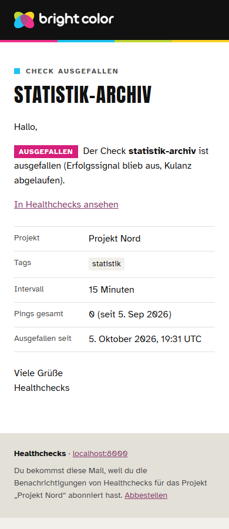
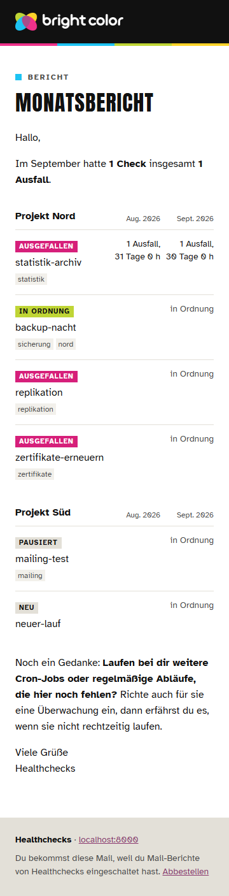

# Werkbank für Healthchecks

Die Oberfläche von [Healthchecks](https://github.com/healthchecks/healthchecks) in der Werkbank von bright color: Onyx-Leiste links mit den Projekten als Akkordeon, Kopfzeile mit Brotkrumen und Umschalter für Hell und Dunkel, warmes Papier als Grund, weiße Karten mit Rundung, Gelb als Aktionsfarbe, Anton in Versalien für Titel, Atkinson Hyperlegible für Text und das Vierfarbband am oberen Rand.

Die Oberfläche spricht Deutsch, die Mails kommen im Hausdesign. Das Image baut auf dem offiziellen Image von Healthchecks auf und folgt jeder neuen Version: Die CI baut, prüft im Browser und veröffentlicht nach `ghcr.io/brightcolor/healthchecks-werkbank`. Auf dem Server holt ein Timer neue Fassungen, sichert vorher die Datenbank und nimmt ein gescheitertes Update selbst zurück.


 

 

**Stand: 1.1.1**, geprüft gegen Healthchecks v4.4.

## Was es macht

- **Leiste links.** Jedes Projekt ist ein Modul im Akkordeon, sein Punkt zeigt den Zustand in der Hausampel. Das offene Projekt führt zu Checks, Integrationen, Badges und Einstellungen. Darunter stehen Neues Projekt, Doku, Konto und Abmelden.
- **Hell und dunkel.** Der Umschalter in der Kopfzeile speichert in dieselbe Darstellungs-Einstellung wie das Profil von Healthchecks; „System“ bleibt dort wählbar.
- **Vollständig.** Die 78 Farbvariablen von Healthchecks zeigen auf Werkbank-Rollen. Jede feste Farbe aus den Stylesheets (in v4.4 sind es 630 Angaben) bekommt beim Bau eine Rolle; eine Farbe ohne Eintrag wird nach Farbton und Helligkeit zugeordnet und im CI-Lauf genannt.
- **Handy.** Unter 900 px fährt die Leiste über den Menüknopf herein. Unter 640 px zeigen Checks, Integrationen, Log sowie Projekt- und Teamlisten jede Zeile zweizeilig: oben der Titel, darunter leise der Rest. Die Kopfzeile nennt dort die aktuelle Seite.
- **Barrierefrei.** Kontrast nach WCAG AA in beiden Modi, Schrift aus den Tokens ab 4,8:1, sichtbarer Fokus, Sprunglink, ruhige Leiste bei `prefers-reduced-motion`.
- **Deutsch.** Seiten, Dialoge, Meldungen, Integrationen und Alarme sprechen Deutsch im Du. Zustände heißen in Ordnung, verspätet und ausgefallen; aus Period wird Intervall, aus Grace Time Kulanz. Relative Zeiten stehen als „vor 1 Tag, 5 Stunden“, Datumsangaben deutsch. Die Doku bleibt englisch. Die Anmeldeseite grüßt mit „Moin.“.
- **Mails im Hausdesign.** Tinte-Balken mit Logo, Vierfarbband, Etikett und Anton-Titel, Hausampel für Zustände, Knopf in Tinte. Jede Mail beginnt mit „Hallo,“ und endet mit „Viele Grüße“ und dem Namen der Instanz; die Nur-Text-Fassungen bleiben, Zeilen bis 78 Zeichen.

## So funktioniert es

```
healthchecks/healthchecks:<version>
  └─ Dockerfile dieses Repos
       ├─ werkbank/einbau.py   setzt zwei Zeilen in templates/base.html: Stylesheet und Leiste
       ├─ werkbank/farben.py   baut static/bc/werkbank.css aus Schriften, Tokens, Rollen,
       │                       Variablen, abgeleiteten Farben und der Stilschicht
       ├─ werkbank/mails.py    setzt das Mail-Layout an die Stelle von templates/emails/base.html
       ├─ werkbank/sprache.py  setzt Filter und Einstellungen ein und wendet den Katalog an
       └─ collectstatic und compress wie im offiziellen Image
```

Der Bau ändert Healthchecks nur über diese Schritte; jeder nennt seine Stellen im Bericht. Findet `einbau.py` einen Anker nicht genau einmal, bringt Healthchecks eine neue Farbvariable mit oder fehlt dem Mail-Layout ein Block des Originals, bricht der Bau ab und nennt die Stelle. Texte, die der Katalog nicht findet, bleiben englisch und stehen im Hinweis (siehe unten).

| Datei | Inhalt |
|---|---|
| `werkbank/einbau.json` | Anker und Zeilen für `base.html` |
| `werkbank/farben.json` | Zuordnung fester Farben zu Rollen, je Art und Modus, mit Ausnahmen je Selektor |
| `werkbank/variablen.css` | die 78 Variablen von Healthchecks auf Rollen |
| `werkbank/rollen.css` | eigene Rollen: Tönungen, Schatten, Zustände |
| `werkbank/stil.css` | Stilschicht |
| `werkbank/templates/bc/leiste.html`, `werkbank/static/bc/leiste.js` | Leiste und Kopfzeile |
| `werkbank/mails/base.html` | Mail-Layout im Hausdesign, dazu die Prüfsumme des Originals |
| `werkbank/deutsch/` | Katalog für Deutsch (siehe „Sprache und Katalog“) |
| `werkbank/erweiterungen.toml` | Filter `zustand`, `art`, `rolle` und Tag `werkbank_mail` für `hc_extras.py`, in jeder Sprache |
| `werkbank/django/` | Einstellungsmodul und Formatmodul, die der Bau nach `hc/` legt |
| `vendor/hausschrift/` | Kopie der Hausschrift von bright color (Tokens, Schriften, Logo, Prüfwerkzeuge) |

Beim Bau liest `farben.py` diese Umgebungsvariablen; die Vorgaben stehen gesammelt in `VORGABEN` am Anfang der Datei.

| Einstellung | Vorgabe | Bedeutung | Grenzen |
|---|---|---|---|
| `WB_REM_BASIS` | `16` | Grundgröße in px, mit der die Hausschrift `rem` meint. Bootstrap 3 setzt `html` auf 10 px, deshalb rechnet der Bau `rem` in px um. | Zahl von 1 bis 64 |
| `WB_DUNKEL_SELEKTOR` | `body.dark` | Selektor, an dem Healthchecks den dunklen Modus festmacht | CSS-Selektor |
| `WB_BASIS_VORLAGE` | `templates/base.html` | Vorlage, aus der der Bau die Liste der Stylesheets liest | Pfad in Healthchecks |
| `WB_STATIC` | `static` | Ordner der Stylesheets von Healthchecks | Pfad in Healthchecks |
| `WB_VARIABLEN_CSS` | `css/variables.css` | Datei mit den Farbvariablen | Pfad in `WB_STATIC` |
| `WB_ZIEL` | `bc/werkbank.css` | fertiges Stylesheet der Werkbank | Pfad in `WB_STATIC` |
| `WB_ZIEL_FARBEN` | `bc/farben.css` | abgeleitete Farben als eigene Datei zum Nachsehen | Pfad in `WB_STATIC` |

## Sprache und Katalog

Das Image spricht Deutsch, sobald `WB_SPRACHE` auf `de` steht (Vorgabe; als Build-Argument `--build-arg WB_SPRACHE=en` bleibt Healthchecks englisch). Die Übersetzung steckt in `werkbank/deutsch/`:

| Datei | Inhalt |
|---|---|
| `katalog.toml` | Stand (die Healthchecks-Version, für die der Katalog vollständig ist), Geltungsbereich, Wörtertabellen und Korrekturen an Djangos eigenen Texten |
| `oberflaeche.toml` | Seiten und Dialoge unter `templates/` außerhalb von Doku und Mails |
| `integrationen.toml` | Einrichtungsseiten und Nachrichten der Integrationen |
| `code.toml` | Texte im Code: Dauern, Formular- und Fehlermeldungen, Skripte, Feldnamen der Alarme |
| `werkbank.toml` | eigene Texte der Werkbank: Leiste, Kopfzeile, Mail-Layout |
| `mails.toml`, `mails/` | alle Mail-Vorlagen auf Deutsch |

Ein Katalog kennt diese Einträge:

- `[[text]]` ersetzt ein ganzes sichtbares Textstück oder einen sichtbaren Attributwert (`title`, `placeholder`, `aria-label`, `alt`, Beschriftung von Knöpfen); `datei = "*"` gilt für alle Vorlagen im Geltungsbereich. Gleiches `en` und `de` markiert ein geprüftes Wort, das bleibt.
- `[[quelltext]]` ersetzt ein genaues Stück Quelle, optional mit `anzahl`; so entstehen ganze Sätze, die im Original über Tags verteilt sind, und Texte in Python und JavaScript.
- `[[vorlage]]` setzt eine ganze Datei aus dem Katalog-Ordner an die Stelle einer Vorlage, solange das Original die genannte Prüfsumme hat. Die Mails nutzen das; ändert Healthchecks eine Mail, bleibt sie englisch, bis die deutsche Fassung angepasst ist.
- Die Wörtertabellen `[zustaende]`, `[arten]` und `[rollen]` geben Zuständen, Integrationsarten und Rollen ihre deutschen Namen für die Filter `zustand`, `art` und `rolle`. Healthchecks führt einige dieser Namen in seinen Migrationen; die Tabellen lassen sie dort unverändert.
- `[[django]]` korrigiert Djangos eigene Übersetzungen, etwa „vor 1 Tag, 5 Stunden“; der Bau schreibt sie als MO-Datei nach `WB_LOCALE`.

Der Bau meldet jedes Textstück, das nach dem Katalog noch englisch ist, und jeden Eintrag ohne Fundstelle. Für neue Texte gibt die Inventur ein TOML-Gerüst aus:
```bash
python werkbank/sprache.py inventur --wurzel <Ordner von Healthchecks> --werkbank werkbank --datei 'templates/front/*'
```

Englisch bleiben die Doku, die Klartextbeschreibung von Cron-Ausdrücken (sie stammt aus der Bibliothek cronsim), Meldungen der Browser-Schnittstelle für Sicherheitsschlüssel, die Meta-Beschreibungen der Integrationsseiten, Antworten der API und Protokollzeilen.

| Einstellung | Vorgabe | Bedeutung | Grenzen |
|---|---|---|---|
| `WB_SPRACHE` | `de` | Sprache des Images; `en` lässt die Texte von Healthchecks stehen | `de` oder `en` |
| `WB_KATALOG` | `deutsch` | Ordner des Katalogs | Ordner in `werkbank/` |
| `WB_KATALOG_KONFIG` | `katalog.toml` | Datei mit Stand, Geltungsbereich und Wörtertabellen | Datei im Katalog-Ordner |
| `WB_ERWEITERUNGEN` | `erweiterungen.toml` | Filter und Tags für `hc_extras.py` | Datei in `werkbank/` |
| `WB_EINSTELLUNGSMODUL` | `hc/werkbank_einstellungen.py` | Ziel des Einstellungsmoduls | Pfad in Healthchecks |
| `WB_FORMATMODUL` | `hc/werkbank_formate` | Ziel des Formatmoduls (Dezimalpunkt für Zahlen, die Skripte lesen) | Pfad in Healthchecks |
| `WB_LOCAL_SETTINGS` | `hc/local_settings.py` | Datei, die das Einstellungsmodul lädt | Pfad in Healthchecks |
| `WB_LOCALE` | `hc/werkbank_locale` | Ordner für die Korrekturen an Djangos Übersetzungen | Pfad in Healthchecks |

Wer eine eigene `hc/local_settings.py` einhängt, übernimmt daraus die Zeile `from hc.werkbank_einstellungen import *`; sonst fehlen Sprache, Formate und Mail-Einstellungen.

## Mails

Das Layout `werkbank/mails/base.html` folgt der Mail-Vorlage der Hausschrift: Papier außen, Weiß innen, 600 px, Stile inline, Geistertabelle und Knopf mit VML für Outlook, Vorschautext, Logo als PNG über die Adresse der Instanz. Vor dem Einsetzen vergleicht der Bau Blöcke und Variablen mit dem Original; fehlt einer, bricht er ab. Weicht nur die Prüfsumme ab, steht ein Hinweis im Bericht.

Der Fuß nennt Instanz, Grund der Mail und den Abmeldelink von Healthchecks. Anschrift, Impressum und Datenschutz erscheinen, sobald ihre Einstellungen gesetzt sind; Healthchecks prüft sie beim Start und hält mit einer Meldung an, die Einstellung, Wert und erwartete Form nennt.

| Einstellung | Vorgabe | Bedeutung | Grenzen |
|---|---|---|---|
| `WB_MAIL_ANSCHRIFT` | leer | Anschrift im Mail-Fuß | eine Zeile, bis 200 Zeichen |
| `WB_MAIL_IMPRESSUM_URL` | leer | Link zum Impressum | Adresse mit `https://` |
| `WB_MAIL_DATENSCHUTZ_URL` | leer | Link zur Datenschutzerklärung | Adresse mit `https://` |

Die drei Werte kommen als Umgebungsvariablen in den Container, etwa über die `.env` von Compose. Für den Bau gelten außerdem:

| Einstellung | Vorgabe | Bedeutung | Grenzen |
|---|---|---|---|
| `WB_MAIL_LAYOUT` | `templates/emails/base.html` | Layout von Healthchecks | Pfad in Healthchecks |
| `WB_MAIL_VORLAGE` | `mails/base.html` | Layout der Werkbank | Pfad in `werkbank/` |
| `WB_MAIL_PRUEFSUMME` | `mails/original.sha256` | Prüfsumme des Originals | Pfad in `werkbank/` |
| `WB_MAIL_LOGO` | `assets/logo/png/bc-logo-light-noclaim.png` | Logo für den Tinte-Balken | Pfad in `vendor/hausschrift/` |
| `WB_MAIL_LOGO_ZIEL` | `static/bc/logo/bc-logo-light-noclaim.png` | Ziel des Logos | Pfad in Healthchecks |

## Name der Instanz

Healthchecks zeigt `SITE_NAME` in Leiste, Anmeldung, Seitentiteln, Doku und Mails. An den Stellen in Versalien (Leiste, Etikett der Anmeldefläche, Überschriften von Anmeldung und Doku) setzt die Werkbank den Namen über das Tag `werkbank_name`: Enthält er einen Namen aus `WB_MARKEN`, steht er dort in `<span class="bc-brand">` und erscheint so, wie er in `SITE_NAME` steht. So bleibt „bright color“ klein, wie die Hausschrift es verlangt.

| Einstellung | Vorgabe | Bedeutung | Grenzen |
|---|---|---|---|
| `WB_MARKEN` | `bright color` | Markennamen, die in Versal-Stellen so bleiben, wie sie geschrieben sind; mit Komma getrennt, leer schaltet das ab | höchstens 10 Namen, je bis 64 Zeichen |

`WB_MARKEN` kommt wie `SITE_NAME` als Umgebungsvariable in den Container. Die Browserprüfung läuft lokal und in der CI mit dem Namen `bright color | health` (`WB_DEV_SITE_NAME`, `WB_TEST_SITE_NAME`) und meldet jede Stelle, an der ein Markenname in Versalien oder Kapitälchen erscheint.

## Fassungen und Tags

| Tag | Bedeutung |
|---|---|
| `4.4-wb1.1.1` | Healthchecks 4.4 mit Werkbank 1.1.1; bleibt unverändert und trägt den Rückweg |
| `4.4` | neueste Werkbank für Healthchecks 4.4 |
| `latest` | neueste Fassung insgesamt; diesem Tag folgt das Update-Skript |

Eine Theme-Änderung erhöht `VERSION`. Ein Push auf `main` mit derselben Fassung wird gebaut und geprüft; veröffentlicht wird mit erhöhter Fassung.

## Neue Healthchecks-Version

Die CI schaut viermal täglich nach einem neuen Release. Liegt das Basis-Image auf Docker Hub, baut sie für amd64 und arm64 und prüft:

- Einheitstests, Shellcheck und Lint der Hausschrift, dazu die Vollständigkeit des Katalogs gegen die Version aus `katalog.toml`,
- jede Vorlage kompiliert in der Testinstanz,
- jede Seite hell und dunkel im Browser mit Kontrastlauf, sechs Breiten ohne Querscrollen, Listen auf dem Handy, Knöpfe mit ganzer Beschriftung,
- jede Seite und jede Mail ohne Markennamen in Versalien,
- jede Mail mit Musterdaten bei 360, 390 und 760 px, mit Kontrast, Layout, deutschem Betreff und Textzeilen bis 78 Zeichen,
- die Update-Probe gegen eine lokale Registry: Wechsel, gleiche Fassung, Rückweg mit Datenbank, Auslassen der zurückgenommenen Fassung, `--erneut`, ungültige und abweichende Einstellungen.

Ist alles grün, gehen die Tags nach ghcr.io; scheitert ein Schreibzugriff dort, versucht die CI es bis zu `WB_VERSUCHE`-mal (Vorgabe 3, Pause `WB_VERSUCH_PAUSE` mit Vorgabe 20 Sekunden). Ist etwas rot, geht nichts raus: Ein Issue mit dem Label `theme-rot` nennt die gescheiterte Prüfung mit Auszug und Link zum Lauf, und GitHub schickt eine Mail. Nach der Anpassung und einem Push auf `main` schließt der nächste grüne Lauf das Issue.

Texte, die der Katalog in einer neuen Version nicht findet, halten nichts auf: Sie erscheinen englisch, die Fassung geht raus, und ein Issue mit dem Label `uebersetzung` (`WB_HINWEIS_LABEL`) nennt die Stellen mit Datei und Text, je Tabelle höchstens `WB_BERICHT_ZEILEN` Zeilen (Vorgabe 50). Die Zusammenfassung jedes Laufs zeigt denselben Abschnitt. Sobald der Katalog ergänzt und `stand` in `katalog.toml` auf die neue Version gesetzt ist, schließt der nächste Lauf ohne Hinweise das Issue.

## Auf dem Server

In der `compose.yaml` von Healthchecks:
```yaml
services:
  healthchecks:
    image: ghcr.io/brightcolor/healthchecks-werkbank:${HC_IMAGE_TAG}
```
und in der `.env`:
```
HC_IMAGE_TAG=4.4-wb1.1.1
SITE_NAME=bright color | health
```

Das Update-Skript und seine Einbindung:
```bash
sudo install -m 755 deploy/hc-werkbank-update /usr/local/sbin/
sudo install -m 644 deploy/hc-werkbank-update.service deploy/hc-werkbank-update.timer /etc/systemd/system/
sudo install -m 644 deploy/hc-werkbank-update.logrotate /etc/logrotate.d/hc-werkbank-update
sudo install -m 600 deploy/hc-werkbank.conf.beispiel /etc/hc-werkbank.conf
sudo hc-werkbank-update --nur-pruefen
sudo systemctl daemon-reload && sudo systemctl enable --now hc-werkbank-update.timer
```
Der Dienst ruft das Skript über `hc-run hc-werkbank-update` auf; die Ping-Adresse des zugehörigen Checks liegt in `/etc/hc-run.d/hc-werkbank-update.url`.

Ein Lauf sieht nach `latest`, liest die Fassung aus dem Label `org.opencontainers.image.version` und endet, wenn sie schon läuft. Sonst sichert er die SQLite-Datenbank mit der Sicherungsfunktion von SQLite, prüft die Kopie, setzt den festen Tag in die `.env`, startet neu und prüft Container, Statusadresse und Anmeldeseite. Scheitert das, geht er auf den alten Tag zurück, spielt die Datenbank zurück und meldet den Grund. Pings, die zwischen Sicherung und Rückweg ankommen, gehen dabei verloren.

Eine zurückgenommene Fassung vermerkt das Skript in `FAILED_FILE`. Spätere Läufe lassen sie aus und enden mit 1; der Check bei Healthchecks bleibt so rot, bis jemand nachsieht. Nach der Klärung versucht `sudo hc-werkbank-update --erneut` die Fassung noch einmal. Erscheint eine neuere Fassung, läuft sie normal durch und löscht den Vermerk.

| Einstellung | Vorgabe | Bedeutung | Grenzen |
|---|---|---|---|
| `IMAGE` | `ghcr.io/brightcolor/healthchecks-werkbank` | verfolgtes Image | Image-Name ohne Tag |
| `TRACK_TAG` | `latest` | beweglicher Tag | gültiger Tag |
| `COMPOSE_DIR` | `/opt/healthchecks` | Ordner mit `compose.yaml` und `.env` | vorhandener Ordner |
| `SERVICE` | `healthchecks` | Dienst in der Compose-Datei | Dienst muss existieren |
| `TAG_VARIABLE` | `HC_IMAGE_TAG` | Variable in der `.env` mit dem Tag | Name in Großbuchstaben, muss in der `.env` stehen |
| `DB_PATH` | Wert von `DB_NAME` aus der `.env` | SQLite-Datei im Container | absoluter Pfad |
| `BACKUP_DIR` | `/root/backups/healthchecks` | Ablage der Sicherungen | absoluter Pfad |
| `BACKUP_KEEP` | `10` | Zahl der Sicherungen, die bleiben | 1 bis 100 |
| `WAIT_SECONDS` | `180` | Frist, bis der Container gesund sein muss | 30 bis 1800 |
| `APP_PORT` | `8000` | Port von Healthchecks im Container | 1 bis 65535 |
| `CHECK_PATHS` | `/api/v3/status/ /accounts/login/` | Pfade, die mit 200 antworten müssen | Pfade mit `/` am Anfang |
| `CHECK_TIMEOUT` | `10` | Frist je Prüfanfrage in Sekunden | 1 bis 120 |
| `STYLE_MARKER` | `bc/werkbank` | Text, den jede geprüfte HTML-Seite enthält | mindestens ein Zeichen |
| `LOG_FILE` | `/var/log/hc-werkbank-update.log` | Protokoll der Läufe | absoluter Pfad |
| `LOCK_FILE` | `/run/lock/hc-werkbank-update.lock` | Sperre gegen doppelte Läufe | absoluter Pfad |
| `FAILED_FILE` | `/var/lib/hc-werkbank-update/failed-version` | Vermerk der zurückgenommenen Fassung | absoluter Pfad |

Rückgabewerte: 0 aktuell oder gewechselt; 1 gescheitert und zurückgenommen, Fassung ausgelassen oder Image nicht erreichbar; 2 ungültige Einstellung; 3 Rückweg gescheitert (das Protokoll nennt dann die Sicherung und die Handgriffe).

**Rückweg von Hand:** Timer stoppen (`systemctl disable --now hc-werkbank-update.timer`), in der `.env` den gewünschten Tag eintragen oder in der `compose.yaml` wieder `healthchecks/healthchecks:<version>` nennen, die Datenbank aus `BACKUP_DIR` zurückspielen, `docker compose up -d`.

## Erste Einrichtung einer frischen Instanz

Healthchecks legt das erste Admin-Konto über die Kommandozeile im Container an, die nur der Betreiber erreicht:
```bash
docker compose exec healthchecks ./manage.py createsuperuser
```
Danach meldet sich das Konto auf der Anmeldeseite an.

## Lokal entwickeln

Lokal läuft Healthchecks direkt mit Python 3.13; die Browserprüfung braucht Node.js 22 und Edge oder Chrome (`WB_BROWSER_KANAL`, Vorgabe `msedge`).
```bash
python tools/dev.py vorbereiten
python tools/dev.py starten
npm ci
python tools/dev.py pruefen
```
`vorbereiten` legt `.venv/` an, holt Healthchecks nach `.upstream/`, setzt die Werkbank ein und legt Musterdaten an; der Zugang der Musterkonten steht in `.upstream/dev-zugang.txt`. Nach Änderungen an `stil.css`, `rollen.css`, `variablen.css`, `farben.json` oder `leiste.js` baut `python tools/dev.py stil` neu, der Server läuft weiter. Nach Änderungen an Vorlagen, am Katalog oder an den Mails setzt `python tools/dev.py einsetzen` alles neu ein und meldet englische Reste; danach den Server neu starten. `python tools/dev.py vorlagen` kompiliert jede Vorlage, `python tools/dev.py mails` rendert jede Mail mit den Musterdaten nach `tests/e2e/ergebnisse/mails/`. Unter Windows bricht `vorbereiten` bei laufendem Server ab, bevor es die Arbeitskopie ersetzt. Der lokale Server heißt wie hc.bcsrv.de `bright color | health`; `WB_DEV_SITE_NAME` setzt einen anderen Namen.

Weitere Prüfungen:
```bash
.venv/Scripts/python -m pytest -q
.venv/Scripts/python vendor/hausschrift/scripts/bc_check.py lint werkbank --variant workbench
```
Unter Linux heißt der Pfad `.venv/bin/python`.

## Lizenz

Der Code dieses Repos steht unter der BSD 2-Clause License (`LICENSE`). Healthchecks steht unter der BSD 3-Clause License (`UPSTREAM-LICENCE`). Die Schriften stehen unter der SIL Open Font License (`vendor/hausschrift/assets/fonts/OFL.txt`). Die Logos sind Marken von bright color und von der Lizenz dieses Repos ausgenommen.
