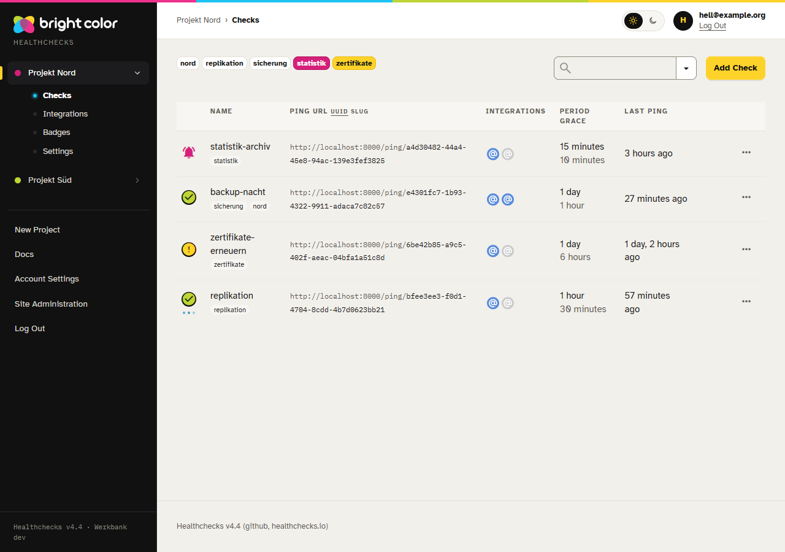
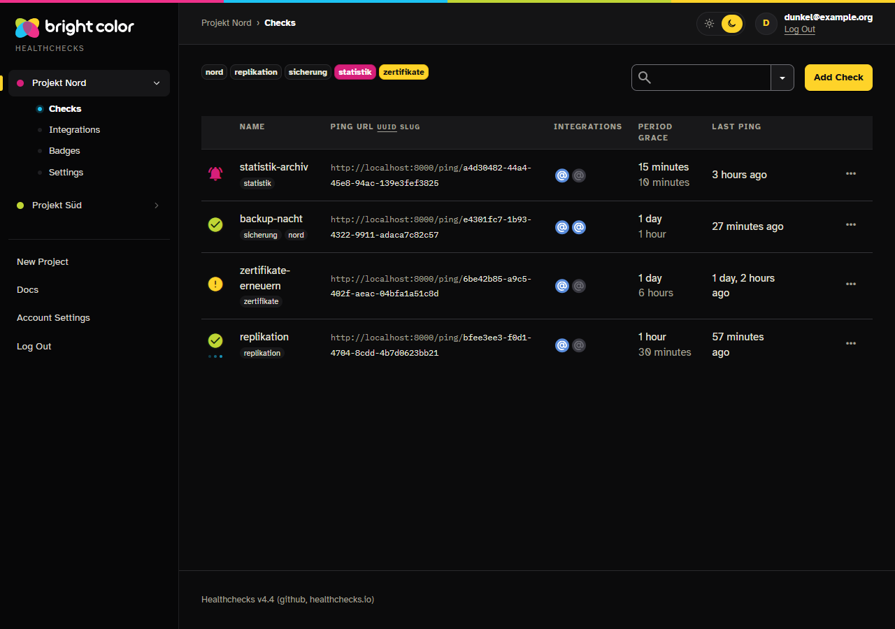
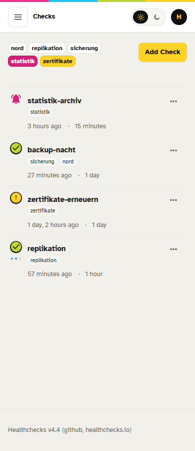
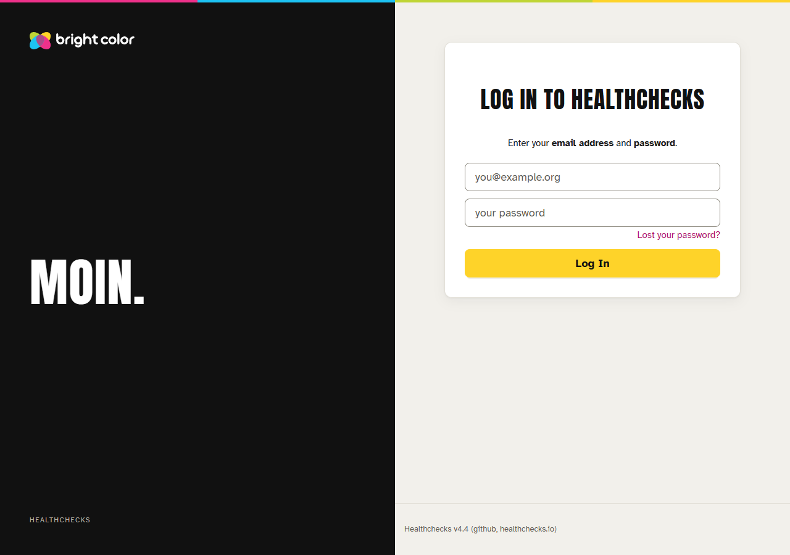

# Werkbank für Healthchecks

Die Oberfläche von [Healthchecks](https://github.com/healthchecks/healthchecks) in der Werkbank von bright color: Onyx-Leiste links mit den Projekten als Akkordeon, Kopfzeile mit Brotkrumen und Umschalter für Hell und Dunkel, warmes Papier als Grund, weiße Karten mit Rundung, Gelb als Aktionsfarbe, Anton in Versalien für Titel, Atkinson Hyperlegible für Text und das Vierfarbband am oberen Rand.

Das Image baut auf dem offiziellen Image von Healthchecks auf und folgt jeder neuen Version: Die CI baut, prüft im Browser und veröffentlicht nach `ghcr.io/brightcolor/healthchecks-werkbank`. Auf dem Server holt ein Timer neue Fassungen, sichert vorher die Datenbank und nimmt ein gescheitertes Update selbst zurück.




 

**Stand: 1.0.0**, geprüft gegen Healthchecks v4.4.

## Was es macht

- **Leiste links.** Jedes Projekt ist ein Modul im Akkordeon, sein Punkt zeigt den Zustand in der Hausampel. Das offene Projekt führt zu Checks, Integrations, Badges und Settings. Darunter stehen New Project, Docs, Account Settings und Log Out.
- **Hell und dunkel.** Der Umschalter in der Kopfzeile speichert in dieselbe Darstellungs-Einstellung wie das Profil von Healthchecks; „System“ bleibt dort wählbar.
- **Vollständig.** Die 78 Farbvariablen von Healthchecks zeigen auf Werkbank-Rollen. Jede feste Farbe aus den Stylesheets (in v4.4 sind es 630 Angaben) bekommt beim Bau eine Rolle; eine Farbe ohne Eintrag wird nach Farbton und Helligkeit zugeordnet und im CI-Lauf genannt.
- **Handy.** Unter 900 px fährt die Leiste über den Menüknopf herein. Unter 640 px zeigen Checks, Integrationen, Log sowie Projekt- und Teamlisten jede Zeile zweizeilig: oben der Titel, darunter leise der Rest. Die Kopfzeile nennt dort die aktuelle Seite.
- **Barrierefrei.** Kontrast nach WCAG AA in beiden Modi, Schrift aus den Tokens ab 4,8:1, sichtbarer Fokus, Sprunglink, ruhige Leiste bei `prefers-reduced-motion`.
- **Texte.** Die Oberfläche bleibt englisch wie Healthchecks; die Anmeldeseite grüßt mit „Moin.“.

## So funktioniert es

```
healthchecks/healthchecks:<version>
  └─ Dockerfile dieses Repos
       ├─ werkbank/einbau.py   setzt zwei Zeilen in templates/base.html: Stylesheet und Leiste
       ├─ werkbank/farben.py   baut static/bc/werkbank.css aus Schriften, Tokens, Rollen,
       │                       Variablen, abgeleiteten Farben und der Stilschicht
       └─ collectstatic und compress wie im offiziellen Image
```

Der Code von Healthchecks bleibt unverändert. Findet `einbau.py` einen Anker nicht genau einmal, oder bringt Healthchecks eine neue Farbvariable mit, bricht der Bau ab und nennt die Stelle.

| Datei | Inhalt |
|---|---|
| `werkbank/einbau.json` | Anker und Zeilen für `base.html` |
| `werkbank/farben.json` | Zuordnung fester Farben zu Rollen, je Art und Modus, mit Ausnahmen je Selektor |
| `werkbank/variablen.css` | die 78 Variablen von Healthchecks auf Rollen |
| `werkbank/rollen.css` | eigene Rollen: Tönungen, Schatten, Zustände |
| `werkbank/stil.css` | Stilschicht |
| `werkbank/templates/bc/leiste.html`, `werkbank/static/bc/leiste.js` | Leiste und Kopfzeile |
| `vendor/hausschrift/` | Kopie der Hausschrift von bright color (Tokens, Schriften, Logo, Prüfwerkzeuge) |

Beim Bau liest `farben.py` diese Umgebungsvariablen; die Vorgaben stehen gesammelt in `VORGABEN` am Anfang der Datei.

| Einstellung | Vorgabe | Bedeutung | Grenzen |
|---|---|---|---|
| `WB_REM_BASIS` | `16` | Grundgröße in px, mit der die Hausschrift `rem` meint. Bootstrap 3 setzt `html` auf 10 px, deshalb rechnet der Bau `rem` in px um. | Zahl von 1 bis 64 |
| `WB_DUNKEL_SELEKTOR` | `body.dark` | Selektor, an dem Healthchecks den dunklen Modus festmacht | CSS-Selektor |
| `WB_BASIS_VORLAGE` | `templates/base.html` | Vorlage, aus der der Bau die Liste der Stylesheets liest | Pfad in Healthchecks |
| `WB_STATIC` | `static` | Ordner der Stylesheets von Healthchecks | Pfad in Healthchecks |
| `WB_VARIABLEN_CSS` | `css/variables.css` | Datei mit den Farbvariablen | Pfad in `WB_STATIC` |
| `WB_ZIEL` | `bc/werkbank.css` | fertiges Stylesheet der Werkbank | Pfad in `WB_STATIC` |
| `WB_ZIEL_FARBEN` | `bc/farben.css` | abgeleitete Farben als eigene Datei zum Nachsehen | Pfad in `WB_STATIC` |

## Fassungen und Tags

| Tag | Bedeutung |
|---|---|
| `4.4-wb1.0.0` | Healthchecks 4.4 mit Werkbank 1.0.0; bleibt unverändert und trägt den Rückweg |
| `4.4` | neueste Werkbank für Healthchecks 4.4 |
| `latest` | neueste Fassung insgesamt; diesem Tag folgt das Update-Skript |

Eine Theme-Änderung erhöht `VERSION`. Ein Push auf `main` mit derselben Fassung wird gebaut und geprüft; veröffentlicht wird mit erhöhter Fassung.

## Neue Healthchecks-Version

Die CI schaut viermal täglich nach einem neuen Release. Liegt das Basis-Image auf Docker Hub, baut sie für amd64 und arm64 und prüft:

- Einheitstests, Shellcheck und Lint der Hausschrift,
- jede Seite hell und dunkel im Browser mit Kontrastlauf, sechs Breiten ohne Querscrollen, Listen auf dem Handy,
- die Update-Probe gegen eine lokale Registry: Wechsel, gleiche Fassung, Rückweg mit Datenbank, Auslassen der zurückgenommenen Fassung, `--erneut`, ungültige und abweichende Einstellungen.

Ist alles grün, gehen die Tags nach ghcr.io. Ist etwas rot, geht nichts raus: Ein Issue mit dem Label `theme-rot` nennt die gescheiterte Prüfung mit Auszug und Link zum Lauf, und GitHub schickt eine Mail. Nach der Anpassung und einem Push auf `main` schließt der nächste grüne Lauf das Issue.

## Auf dem Server

In der `compose.yaml` von Healthchecks:
```yaml
services:
  healthchecks:
    image: ghcr.io/brightcolor/healthchecks-werkbank:${HC_IMAGE_TAG}
```
und in der `.env`:
```
HC_IMAGE_TAG=4.4-wb1.0.0
```

Das Update-Skript und seine Einbindung:
```bash
sudo install -m 755 deploy/hc-werkbank-update /usr/local/sbin/
sudo install -m 644 deploy/hc-werkbank-update.service deploy/hc-werkbank-update.timer /etc/systemd/system/
sudo install -m 644 deploy/hc-werkbank-update.logrotate /etc/logrotate.d/hc-werkbank-update
sudo install -m 600 deploy/hc-werkbank.conf.beispiel /etc/hc-werkbank.conf
sudo hc-werkbank-update --nur-pruefen
sudo systemctl daemon-reload && sudo systemctl enable --now hc-werkbank-update.timer
```
Der Dienst ruft das Skript über `hc-run hc-werkbank-update` auf; die Ping-Adresse des zugehörigen Checks liegt in `/etc/hc-run.d/hc-werkbank-update.url`.

Ein Lauf sieht nach `latest`, liest die Fassung aus dem Label `org.opencontainers.image.version` und endet, wenn sie schon läuft. Sonst sichert er die SQLite-Datenbank mit der Sicherungsfunktion von SQLite, prüft die Kopie, setzt den festen Tag in die `.env`, startet neu und prüft Container, Statusadresse und Anmeldeseite. Scheitert das, geht er auf den alten Tag zurück, spielt die Datenbank zurück und meldet den Grund. Pings, die zwischen Sicherung und Rückweg ankommen, gehen dabei verloren.

Eine zurückgenommene Fassung vermerkt das Skript in `FAILED_FILE`. Spätere Läufe lassen sie aus und enden mit 1; der Check bei Healthchecks bleibt so rot, bis jemand nachsieht. Nach der Klärung versucht `sudo hc-werkbank-update --erneut` die Fassung noch einmal. Erscheint eine neuere Fassung, läuft sie normal durch und löscht den Vermerk.

| Einstellung | Vorgabe | Bedeutung | Grenzen |
|---|---|---|---|
| `IMAGE` | `ghcr.io/brightcolor/healthchecks-werkbank` | verfolgtes Image | Image-Name ohne Tag |
| `TRACK_TAG` | `latest` | beweglicher Tag | gültiger Tag |
| `COMPOSE_DIR` | `/opt/healthchecks` | Ordner mit `compose.yaml` und `.env` | vorhandener Ordner |
| `SERVICE` | `healthchecks` | Dienst in der Compose-Datei | Dienst muss existieren |
| `TAG_VARIABLE` | `HC_IMAGE_TAG` | Variable in der `.env` mit dem Tag | Name in Großbuchstaben, muss in der `.env` stehen |
| `DB_PATH` | Wert von `DB_NAME` aus der `.env` | SQLite-Datei im Container | absoluter Pfad |
| `BACKUP_DIR` | `/root/backups/healthchecks` | Ablage der Sicherungen | absoluter Pfad |
| `BACKUP_KEEP` | `10` | Zahl der Sicherungen, die bleiben | 1 bis 100 |
| `WAIT_SECONDS` | `180` | Frist, bis der Container gesund sein muss | 30 bis 1800 |
| `APP_PORT` | `8000` | Port von Healthchecks im Container | 1 bis 65535 |
| `CHECK_PATHS` | `/api/v3/status/ /accounts/login/` | Pfade, die mit 200 antworten müssen | Pfade mit `/` am Anfang |
| `CHECK_TIMEOUT` | `10` | Frist je Prüfanfrage in Sekunden | 1 bis 120 |
| `STYLE_MARKER` | `bc/werkbank` | Text, den jede geprüfte HTML-Seite enthält | mindestens ein Zeichen |
| `LOG_FILE` | `/var/log/hc-werkbank-update.log` | Protokoll der Läufe | absoluter Pfad |
| `LOCK_FILE` | `/run/lock/hc-werkbank-update.lock` | Sperre gegen doppelte Läufe | absoluter Pfad |
| `FAILED_FILE` | `/var/lib/hc-werkbank-update/failed-version` | Vermerk der zurückgenommenen Fassung | absoluter Pfad |

Rückgabewerte: 0 aktuell oder gewechselt; 1 gescheitert und zurückgenommen, Fassung ausgelassen oder Image nicht erreichbar; 2 ungültige Einstellung; 3 Rückweg gescheitert (das Protokoll nennt dann die Sicherung und die Handgriffe).

**Rückweg von Hand:** Timer stoppen (`systemctl disable --now hc-werkbank-update.timer`), in der `.env` den gewünschten Tag eintragen oder in der `compose.yaml` wieder `healthchecks/healthchecks:<version>` nennen, die Datenbank aus `BACKUP_DIR` zurückspielen, `docker compose up -d`.

## Erste Einrichtung einer frischen Instanz

Healthchecks legt das erste Admin-Konto über die Kommandozeile im Container an, die nur der Betreiber erreicht:
```bash
docker compose exec healthchecks ./manage.py createsuperuser
```
Danach meldet sich das Konto auf der Anmeldeseite an.

## Lokal entwickeln

Lokal läuft Healthchecks direkt mit Python 3.13; die Browserprüfung braucht Node.js 22 und Edge oder Chrome (`WB_BROWSER_KANAL`, Vorgabe `msedge`).
```bash
python tools/dev.py vorbereiten
python tools/dev.py starten
npm ci
python tools/dev.py pruefen
```
`vorbereiten` legt `.venv/` an, holt Healthchecks nach `.upstream/`, setzt die Werkbank ein und legt Musterdaten an; der Zugang der Musterkonten steht in `.upstream/dev-zugang.txt`. Nach Änderungen an `stil.css`, `rollen.css`, `variablen.css`, `farben.json` oder `leiste.js` baut `python tools/dev.py stil` neu, der Server läuft weiter. Nach Änderungen an Vorlagen setzt `python tools/dev.py einsetzen` sie ein; danach den Server neu starten. Unter Windows bricht `vorbereiten` bei laufendem Server ab, bevor es die Arbeitskopie ersetzt.

Weitere Prüfungen:
```bash
.venv/Scripts/python -m pytest -q
.venv/Scripts/python vendor/hausschrift/scripts/bc_check.py lint werkbank --variant workbench
```
Unter Linux heißt der Pfad `.venv/bin/python`.

## Lizenz

Der Code dieses Repos steht unter der BSD 2-Clause License (`LICENSE`). Healthchecks steht unter der BSD 3-Clause License (`UPSTREAM-LICENCE`). Die Schriften stehen unter der SIL Open Font License (`vendor/hausschrift/assets/fonts/OFL.txt`). Die Logos sind Marken von bright color und von der Lizenz dieses Repos ausgenommen.
